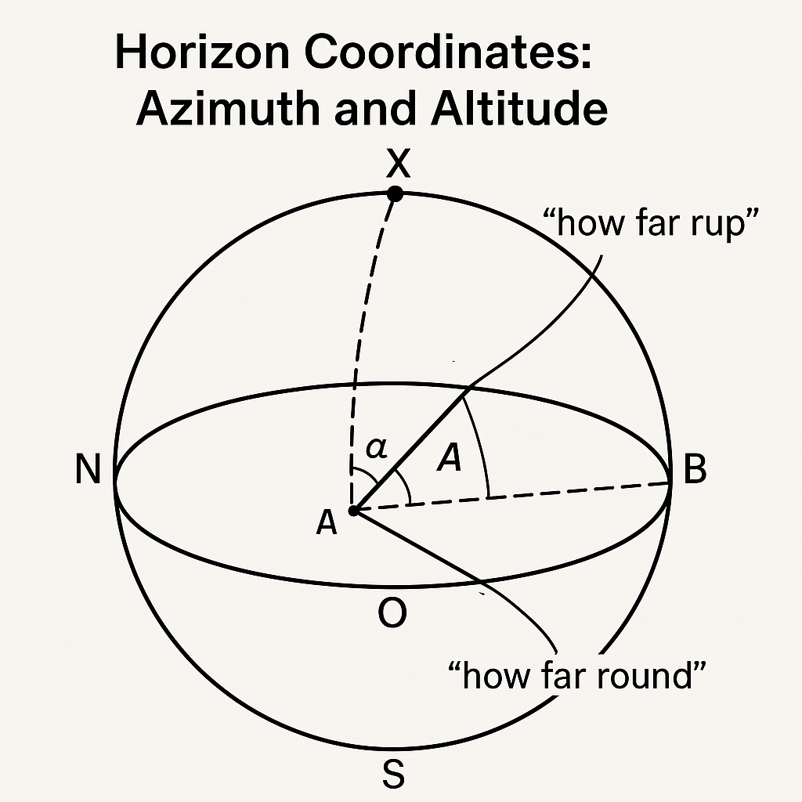
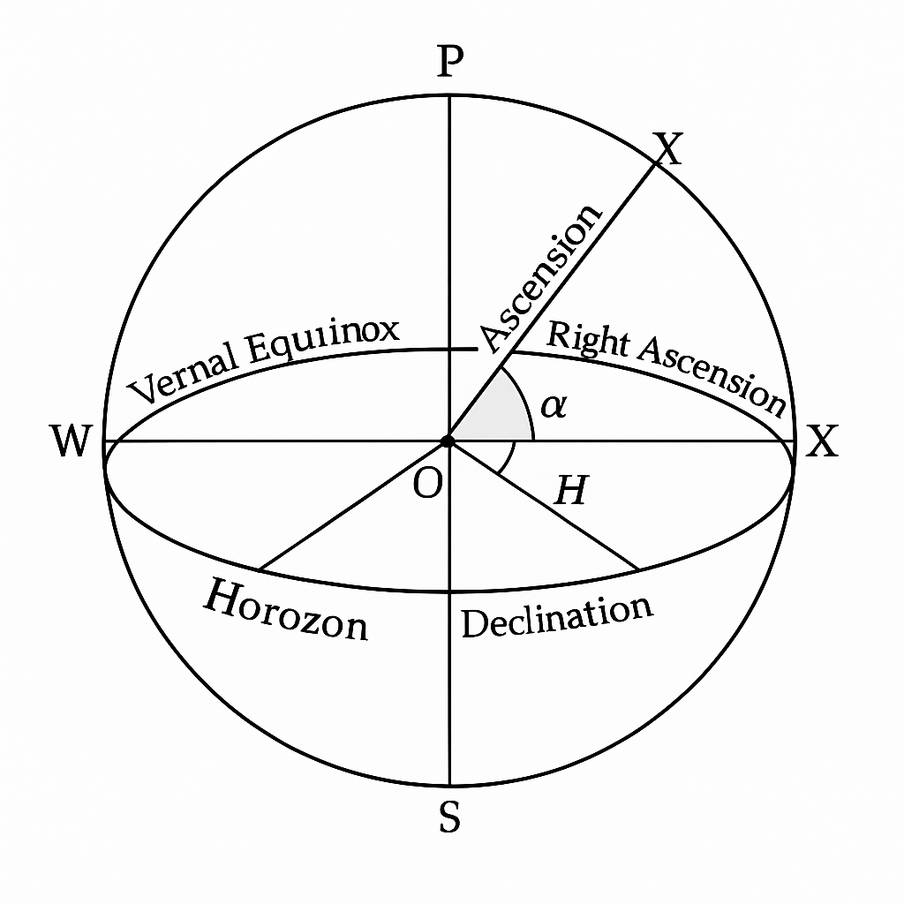
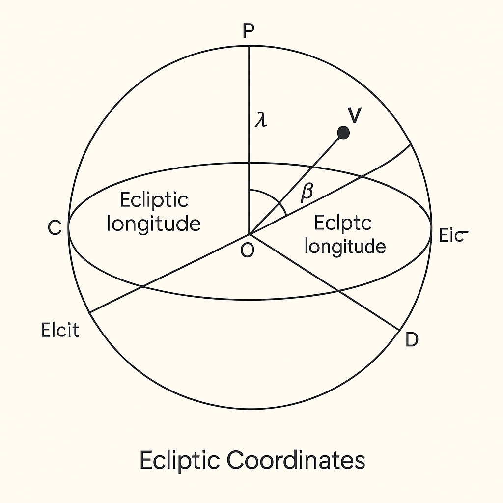

- **Tropical Year** : A tropical year is the time it takes for the Earth to complete one orbit around the Sun, measured from one spring equinox to the next. It's about 365.24 days long and determines the length of our calendar year.

- **Julian Calendar**: An old calendar introduced by Julius Caesar in 45 BC, with a year lasting 365.25 days, including a leap year every 4 years.

- **Gregorian calendar**: The calendar system most of the world uses today. It was introduced by Pope Gregory XIII in 1582 to fix errors in the Julian calendar, making the year 365.2425 days long with leap years to keep our dates in sync with the seasons.

- **Civil Calendar**: The official calendar used by a country for everyday activities, often based on the Gregorian calendar today.

- **Fundamental epoch:** A chosen starting point in time for a particular system of measurement.
- **Greenwich mean noon:** Midday (12:00 PM) at the Greenwich meridian.
- **Greenwich meridian:** The prime meridian (0° longitude) that passes through Greenwich, UK, used as a reference for time zones.
- **Julian day number (or Julian date):** The number of days (and fraction of a day) that have elapsed since the fundamental epoch of Greenwich mean noon on January 1, 4713 BC.
- **UT (Universal Time):** A time standard based on the Earth's rotation, often used as a global reference time.
- **Civil day:** The common 24-hour day that typically begins at midnight in a local time zone.
- **Time zone 0:** The time zone centered on the Greenwich meridian, which uses UT.


Here's a **Markdown summary** with **clear definitions** and **relationships between time standards**, suitable for inclusion in Obsidian:

---

## 🌍 Time Standards and Conversions in Civil and Astronomical Use

### 🕰️ Universal Time (UT)

* **Basis**: Earth's rotation as observed at the Greenwich meridian (longitude 0°).
* **Usage**: Serves as a foundation for civil timekeeping.
* **Irregularity**: Earth’s rotation is not perfectly uniform.

---

### ⏱️ International Atomic Time (TAI)

* **Definition**: A time standard based on atomic clocks coordinated globally.
* **Source**: Managed by the Bureau International de l’Heure (Paris).
* **Accuracy**: Extremely uniform due to atomic standards.
* **Relation**:

  * TAI is **ahead** of UTC by a whole number of seconds.
  * Example (June 2010): `TAI − UTC = 34 seconds`.

---

### 🛰️ Coordinated Universal Time (UTC)

* **Definition**: Atomic time adjusted with **leap seconds** to stay within **0.9 seconds** of UT.
* **Leap Seconds**: Inserted occasionally (typically June or December) to match Earth's rotation.
* **Usage**:

  * Basis of **legal civil timekeeping** worldwide.
  * Broadcast by stations like:

    * DCF 77 (Germany)
    * MSF 60 (UK)
    * WWV (USA)
* **Relation**:

  * **UTC ≈ UT** (with ±0.9 seconds max deviation)
  * **UTC = TAI − (Leap Seconds)**

---

### 📡 GPS Time

* **Definition**: Atomic time used by the Global Positioning System.
* **Maintained by**: US Naval Observatory.
* **Difference**:

  * Started as **equal to UTC** on 1980-01-06.
  * Does **not** include leap seconds.
  * Example (June 2010): `GPS Time = UTC + 15 seconds`.

---

### ⏳ Greenwich Mean Time (GMT)

* **Legacy Term**: Often used interchangeably with UTC.
* **Caution**: Before 1925, GMT started at **midday**, so was **12 hours offset** from UT.
* **Modern Usage**: Treated as equivalent to UTC in casual and broadcast use (e.g., BBC World Service).

---

### 🌐 Terrestrial Time (TT)

* **Definition**: Uniform time scale used in precise astronomy.
* **Relation**:

  * `TT = TAI + 32.184 seconds`
* **Replaces**:

  * **Ephemeris Time (ET)** before 1984.
  * Known as **Terrestrial Dynamic Time (TDT)** until renamed in 1991.

---

### 🕓 Local Time and Time Zones

* **Standard Time**: Most countries define their **local civil time** based on **offsets from UT/UTC**.
* **Daylight Saving Time (DST)**:

  * Adds 1 hour to UT during summer months.
  * In the UK, called **British Summer Time (BST)**.
* **Reason**:

  * To align working hours with daylight.
* **Time Zones**:

  * Typically follow whole-hour offsets from UTC.
  * Adopted globally to maintain noon alignment with the Sun.

---

### 🔄 Summary of Time Standard Relationships

| Time Standard | Definition                | Relation                                 |
| ------------- | ------------------------- | ---------------------------------------- |
| **UT**        | Based on Earth rotation   | ≈ UTC                                    |
| **TAI**       | Atomic clocks             | UTC + leap seconds                       |
| **UTC**       | TAI with leap seconds     | UT ± 0.9 sec                             |
| **GPS Time**  | Atomic, no leap seconds   | UTC + X sec (X = number of leap seconds) |
| **TT**        | Uniform astronomical time | TAI + 32.184 sec                         |
| **GMT**       | Synonym for UTC (modern)  | Historically ≠ UT before 1925            |

---

Here's a concise and clear explanation of **timezone offsets** in Markdown format, suitable for use in Obsidian:

---

## 🕓 Time Zone Offset

### 📌 Definition

A **time zone offset** is the difference in **hours and minutes** between **local time** and **Coordinated Universal Time (UTC)**.

---

### 🧮 Format

Offsets are typically represented as:

```
UTC±[hh]:[mm]
```

* **Positive Offset (UTC+X)**: Time **ahead** of UTC (e.g., India, China, Japan).
* **Negative Offset (UTC−X)**: Time **behind** UTC (e.g., USA, Canada, Brazil).

---

### 🌍 Common Time Zone Offsets

| Region                  | Time Zone Abbreviation | Offset from UTC |
| ----------------------- | ---------------------- | --------------- |
| UK (Winter)             | GMT / UTC              | UTC+00:00       |
| UK (Summer)             | BST                    | UTC+01:00       |
| New York (Winter)       | EST                    | UTC−05:00       |
| New York (Summer)       | EDT                    | UTC−04:00       |
| India                   | IST                    | UTC+05:30       |
| China                   | CST (China)            | UTC+08:00       |
| Japan                   | JST                    | UTC+09:00       |
| Central Europe (Winter) | CET                    | UTC+01:00       |
| Central Europe (Summer) | CEST                   | UTC+02:00       |
| California (Winter)     | PST                    | UTC−08:00       |
| California (Summer)     | PDT                    | UTC−07:00       |

---

### 🧭 How It Works

**Local Time = UTC + Time Zone Offset**

Examples:

* `UTC = 12:00`

  * In India (UTC+05:30): `Local Time = 17:30`
  * In New York (UTC−05:00): `Local Time = 07:00`

---

### ☀️ Daylight Saving Time (DST)

* Some regions shift the clock **+1 hour during summer months**.
* Example: UK shifts from **GMT (UTC+0)** to **BST (UTC+1)** in summer.

---

### 🔁 Time Conversion Logic (Pseudocode)

```text
local_time = utc_time + timezone_offset
utc_time = local_time - timezone_offset
```

---

Here’s a **Markdown-formatted summary** of important terms, definitions, and relationships from your text on **Sidereal Time (ST)** and **Universal Time (UT)**:

---

# 🕰️ Sidereal Time and Universal Time

## 📘 Key Definitions

### **Universal Time (UT)**

* **Definition**: Based on the **apparent motion of the Sun** around the Earth.
* **Purpose**: Governs **local civil time** in any part of the world.
* **Day Definition**: 1 solar day = time between two successive **solar meridian transits** (Sun crossing observer’s meridian).

---

### **Sidereal Time (ST)**

* **Definition**: Time based on the **apparent motion of stars**. Formally, it is the **hour angle of the vernal equinox**.
* **Purpose**: Used by astronomers to track **stellar positions**.
* **Sidereal Clock**: A clock that ensures **stars return to the same position** after exactly 24 sidereal hours.
* **Nature**: Sidereal time advances **faster** than solar (universal) time.

---

## 🔁 Relationships

### 🧭 Solar vs. Sidereal Time

| Feature               | Solar Time (UT)                                   | Sidereal Time (ST)          |
| --------------------- | ------------------------------------------------- | --------------------------- |
| Reference Object      | Sun                                               | Stars                       |
| Basis of Day          | Sun-to-meridian crossing                          | Vernal equinox (star field) |
| Day Length            | \~24 hours                                        | \~23h 56m 4s                |
| Days per Year         | \~365.25 solar days                               | \~366.25 sidereal days      |
| Synchronization Point | Equal once a year (autumnal equinox, \~22 Sept)   |                             |
| Drift                 | Sidereal time gains \~4 minutes/day on solar time |                             |

---

### 🧮 Mathematical Relation (Conceptual)

* **1 sidereal day** = **(1 solar day) × (365.25 / 366.25)**
* Hence:
  `24 sidereal hours ≈ 23h 56m 4s of solar (UT) time`

---

## 📍 Key Events

* **Autumnal Equinox (\~22 Sept)**: ST and UT are equal.
* **6 months later**: ST leads UT by **12 hours**.
* **1 year later**: ST and UT realign.

---
Sure! Here's a simplified explanation of the text:

---

### **Horizon Coordinates: Azimuth and Altitude**

When we look at the sky, we can describe where an object (like a star) is using two angles:

#### **1. Altitude (a):**

* This tells you **how high** the object is above the horizon.
* It's measured in degrees:

  * **0°** means the object is right on the horizon.
  * **90°** means it’s directly above you (at the **zenith**).
  * Negative values mean the object is **below the horizon** (not visible).

#### **2. Azimuth (A):**

* This tells you **which direction** to look on the horizon.
* Measured in degrees **from the North** going clockwise:

  * **0°** = North
  * **90°** = East
  * **180°** = South
  * **270°** = West
  * **360°** = back to North

---

### **Visualize It:**

* Imagine you’re standing on Earth (point **O**), with the sky above as a huge **dome** or **hemisphere**.
* The circle around you—your horizon—is labeled **N** (North), **E**, **S**, **W**.
* Straight above your head is the **zenith** (**Z**).
* A star (**X**) is somewhere in the sky.
* Draw a big circle (a “great circle”) from **Z to X** down to the horizon (point **B**).

  * The **angle from B to X** at point O = **altitude**
  * The **angle from N to B** = **azimuth**

---


### **Important Note:**

* Because Earth rotates, the **altitude and azimuth** of stars **keep changing**.
* This system is great for aiming a telescope **right now**, but not good for **permanently tracking** stars.
* For that, we use a different system explained later.

---

Sure! Here’s a simplified explanation of **Equatorial Coordinates**, broken down clearly:

---

## 🌍 **What are Equatorial Coordinates?**

Equatorial coordinates are a way to map the positions of stars **using the Earth's equator** as a reference, not your local horizon. They're very useful because they don’t change as the Earth rotates.

---

## 🧭 Key Concepts

### 1. **Celestial Sphere**

* Imagine the Earth is a tiny dot and the sky is a giant sphere around it — that's the **celestial sphere**.
* The Earth’s **equator** stretches out to form the **celestial equator**.
* The Earth’s **axis of rotation** points to the **North Celestial Pole (P)**, around which stars seem to rotate.

---

## 🔭 Coordinates on the Celestial Sphere

To locate a star, we use two measurements:

---

### 🧮 1. **Declination (δ)**

* **What it tells you:** **How far north or south** the star is from the celestial equator.
* **Similar to:** Latitude on Earth.
* **Measured in:** Degrees

  * **+ve** (positive): Star is **north** of the equator
  * **–ve** (negative): Star is **south** of the equator

---

### 🕒 2. **Right Ascension (α)**

* **What it tells you:** **How far around** the star is, measured from a fixed point in the sky called the **Vernal Equinox (♈︎)**.
* **Similar to:** Longitude on Earth.
* **Measured in:**

  * **Degrees (0°–360°)** or
  * **Time (0h–24h)**

    * Since Earth spins 360° in 24 hours, 1 hour = 15°

> 📌 Example:
>
> * α = 6h = 6 × 15° = **90°**

---

## 🕰️ What is the Hour Angle (H)?

* **H** tells you **how long it's been** since a star crossed your local meridian (an imaginary line running north-south through the zenith).
* **When H = 0**: The star is highest in the sky — it is "transiting."
* **Measured in:** Degrees or hours

---

---

## 🔄 Why Are These Coordinates Useful?

* **Right ascension (α)** and **declination (δ)** do **not change** over the day (unlike horizon coordinates).
* Perfect for **star maps** and **telescopes** — they help you find stars no matter where or when.

---

## 🔁 Bonus Tip: Conversion

You can convert between degrees and hours easily:

| Hours | Degrees |
| ----- | ------- |
| 1h    | 15°     |
| 2h    | 30°     |
| 6h    | 90°     |
| 24h   | 360°    |

So:

* 1 hour = 15°
* 90° = 6h

---

## 🔧 Real-Life Example

Let’s say:

* A star has **α = 6h**, **δ = +30°**
* That means:

  * It's 6 hours east of the vernal equinox
  * It's 30° above the celestial equator (toward the north)
  * When the **local sidereal time = 6h**, that star will **transit** — be highest in the sky.

---
Sure! Here's a simplified explanation of **Ecliptic Coordinates**:

---

## 🌞 What Are Ecliptic Coordinates?

Ecliptic coordinates are a system used to locate **objects in the Solar System** (like planets, the Sun, or the Moon). It’s based on the **Earth’s orbit** around the Sun — a flat path called the **ecliptic plane**.

---

## 📐 Key Concepts

### 1. **The Ecliptic Plane**

* This is the flat, imaginary surface made by the Earth's orbit around the Sun.
* Other planets' orbits are very close to this plane, which makes it handy for tracking them.

---

### 2. **The Vernal Equinox (♈︎)**

* The point where the **ecliptic** crosses the **celestial equator**.
* It’s the reference direction (like the "starting point") for both **equatorial** and **ecliptic** systems.
* It's where the Sun is on **March 21**, the start of **spring** in the northern hemisphere.

---

### 3. **Obliquity (ε = 23.5°)**

* The **tilt** of the Earth’s axis compared to the ecliptic plane.
* It causes seasons and also separates the **ecliptic plane** from the **equatorial plane**.

---

## 📊 The Coordinates

To locate a planet (like V in the diagram), we use two angles:

---

### 🧮 1. **Ecliptic Longitude (λ)**

* Tells you **how far around** the object is from the vernal equinox, measured **along** the ecliptic.
* Measured in degrees **eastward**, from **0° to 360°**.
* Example: λ = 90° means it's a quarter of the way around the ecliptic from the vernal equinox.

---

### 🧮 2. **Ecliptic Latitude (β)**

* Tells you **how far above or below** the ecliptic plane the object is.
* **+β** = above the ecliptic (north)
* **–β** = below the ecliptic (south)
* The **Sun** always has **β = 0**, because it stays exactly on the ecliptic.

---



---

## ☀️ The Sun’s Motion Through the Year

* On **March 21**, the Sun is at:

  * Right Ascension = 0h
  * Declination = 0°
  * Ecliptic Longitude (λ) = 0°
* As the year goes on, the Sun appears to **move eastward** along the ecliptic.
* After 3 months (around June 21), it reaches **λ = 90°** (summer solstice in the north).
* After 1 full year, it has traveled **360°**, returning to its starting point.

---

## 🪐 Summary

| Coordinate         | Symbol | What it measures                 | Range        | Similar to... |
| ------------------ | ------ | -------------------------------- | ------------ | ------------- |
| Ecliptic Longitude | λ      | How far around on the ecliptic   | 0°–360°      | Longitude     |
| Ecliptic Latitude  | β      | How far above/below the ecliptic | –90° to +90° | Latitude      |

---

Sure! Here's a simplified explanation of **Galactic Coordinates**, followed by a diagram.

---

## 🌌 What Are Galactic Coordinates?

Galactic coordinates are used by astronomers to describe the **positions of stars and other objects within our Milky Way Galaxy**. This system is especially useful when studying our Galaxy’s structure.

---

## 📐 Key Concepts

### 1. **Galactic Plane**

* This is the flat, disk-like shape of the **Milky Way**.
* Most stars (including the Sun) lie close to this plane.

---

### 2. **Galactic Center (G)**

* The center of the Milky Way Galaxy.
* In equatorial coordinates, it’s located at:

  * **Right Ascension (α) = 17h 42.4m**
  * **Declination (δ) = –28°55′**

---

## 🧭 Galactic Coordinates

To describe an object’s position (like a star X), two angles are used:

### 🧮 1. **Galactic Longitude (ℓ)**

* Measures **how far around** the object is from the direction to the **galactic center (G)**.
* Measured in the galactic plane.
* Goes from **0° to 360°**, just like longitude on Earth.
* 0° points directly toward the center of the Galaxy.

---

### 🧮 2. **Galactic Latitude (b)**

* Measures **how far above or below** the galactic plane the object is.
* Ranges from:

  * **+90°** = directly above the plane (north)
  * **–90°** = directly below the plane (south)

---

## 🪐 Example

If a star has:

* **ℓ = 180°**, it’s in the opposite direction of the galactic center.
* **b = 0°**, it lies exactly in the galactic plane.
* **b = +30°**, it lies 30° above the galactic plane.

---

## 📊 Summary

| Coordinate         | Symbol | What it measures                       | Range        |
| ------------------ | ------ | -------------------------------------- | ------------ |
| Galactic Longitude | ℓ      | How far around in the galactic plane   | 0° to 360°   |
| Galactic Latitude  | b      | How far above/below the galactic plane | –90° to +90° |

---

